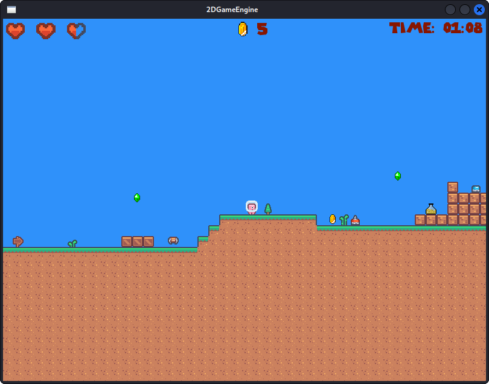
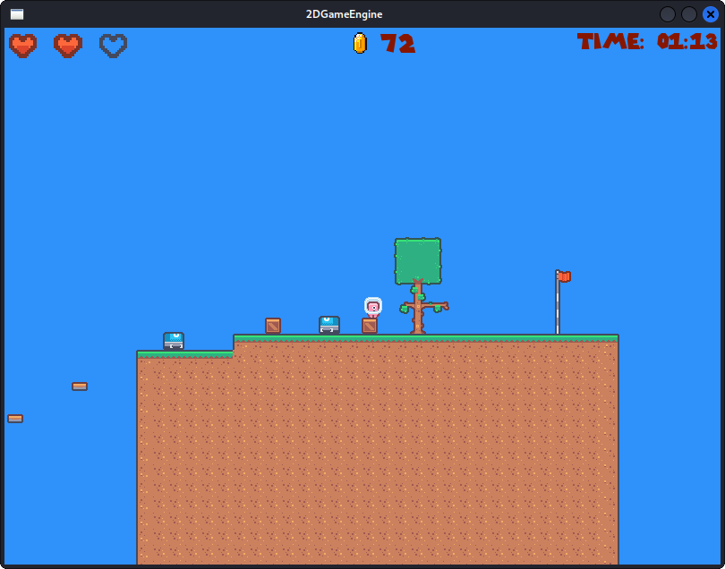
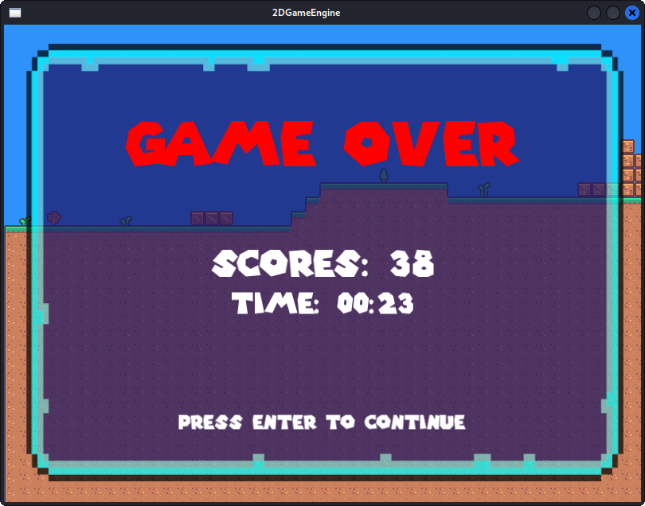
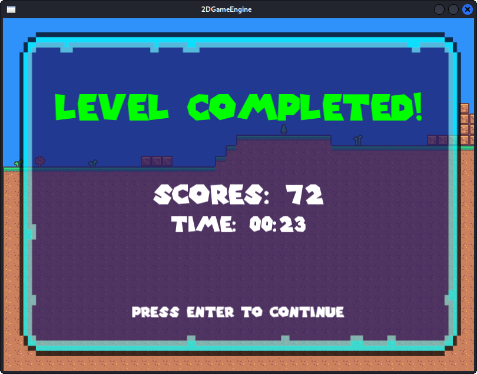
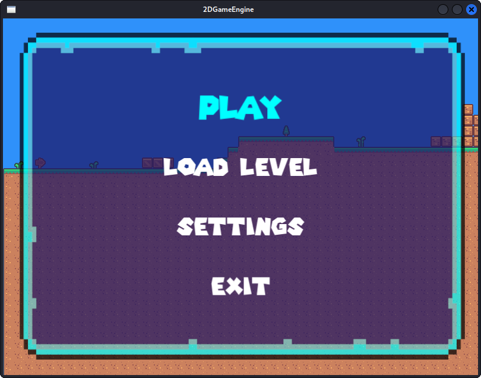

# Pixel Treasures

Welcome to Pixel Treasures, a vibrant 2D platformer where players navigate through pixelated landscapes to collect treasures, avoid enemies, and complete levels within set time limits. With retro-inspired graphics and challenging gameplay, Pixel Treasures offers a nostalgic experience for all fans of classic gaming.

## Features

- **Dynamic Player Movement**: Experience smooth control over the player character with the ability to collide with various ground types and perform agile maneuvers.
- **Interactive Game Menu**: A simple and intuitive menu system that allows players to start new games, pause the action, and exit with ease.
- **Collision Detection**: Players can interact with the environment, colliding with tiles from the side and using them as platforms or obstacles.
- **Engaging Player Animations**: Watch the player character come to life with animations for movements and impacts from enemy encounters.
- **Adaptive Game View**: The camera view adjusts based on the player's position, ensuring optimal visibility throughout the game.
- **Collectibles and Power-ups**: Collect coins, emeralds, and use power-ups like health potions, speed boosts, and jump enhancements to overcome challenges.
- **Enemy Encounters**: Face randomly generated enemies
- **Progress Tracking**: Keep an eye on your health, score, and time with a clear and informative display.

## Status: In Development 🚧

**Note:** Pixel Treasures is a university project and is currently in active development. The game is not yet complete. It is written in C++ and uses the SFML library.

## Academic Project

This game is being developed as a university project. It serves as a practical exploration of game development concepts and C++ programming. Using SFML (Simple and Fast Multimedia Library), the project aims to implement fundamental game design patterns and features.

## Screenshots

Here's a glimpse of Pixel Treasures in various stages of gameplay:

### In-Game Action

*Exploring the pixel world and collecting treasures.*

*Battling enemies and overcoming obstacles.*

### Game Over

*The end of an adventure, but not the journey.*

### Level Completion

*Celebrating the successful completion of a level.*

### Game Menu

*Navigate through the game's options in this simple and intuitive menu.*
